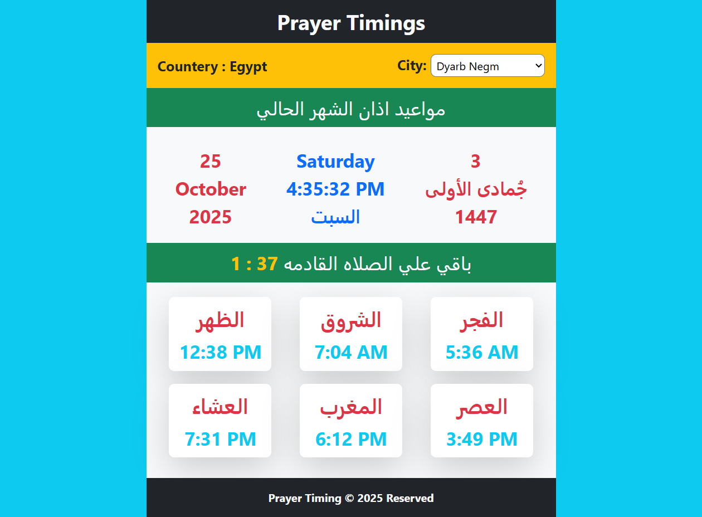
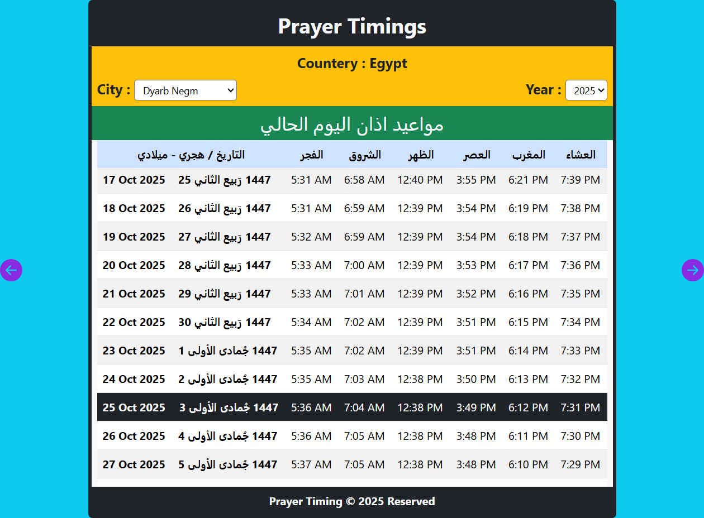
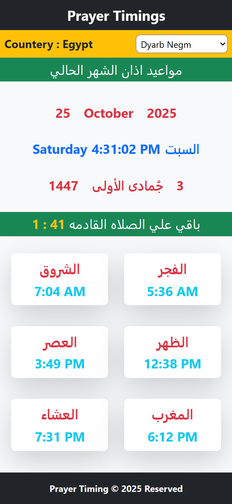
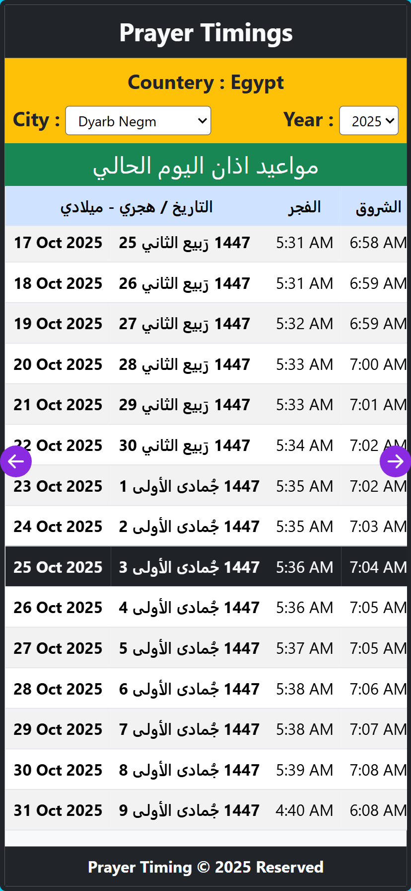
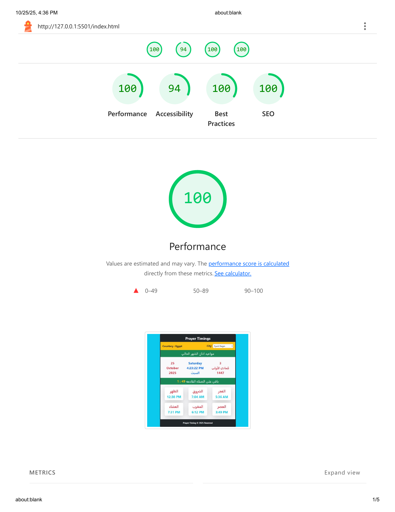

# 🕌 Prayer Timings App

A modern and responsive web application that displays **daily and monthly Islamic prayer times** for different cities in Egypt.  
Built using **HTML, CSS, JavaScript, Bootstrap**, and **Date-Fns**, with data fetched dynamically from the [Aladhan API](https://aladhan.com/prayer-times-api).

---

🚀 Live Demo
 
👉 [https://github.com/ahmednabil22224/PrayerTimings](https://ahmednabil22224.github.io/PrayerTimings/)

---

## 🌟 Features

✅ **Daily Prayer Times** — Displays all prayer times (Fajr, Sunrise, Dhuhr, Asr, Maghrib, Isha) for the current day.  
✅ **Monthly Calendar** — View all prayer times for the selected month and year.  
✅ **Dynamic City Selection** — Choose any supported city in Egypt to update timings instantly.  
✅ **Current Time & Hijri Date** — Shows the current Gregorian and Hijri dates and time.  
✅ **Remaining Time Counter** — Displays how much time is left until the next prayer.

---

## 🛠️ Tech Stack

| Category      | Tools / Libraries                                                |
| ------------- | ---------------------------------------------------------------- |
| Frontend      | HTML5, CSS3, JavaScript (ES Modules)                             |
| UI Framework  | [Bootstrap 5](https://getbootstrap.com/)                         |
| API           | [Aladhan Prayer Times API](https://aladhan.com/prayer-times-api) |
| Date Handling | [Date-Fns](https://date-fns.org/)                                |
| HTTP Client   | [Axios](https://axios-http.com/)                                 |

---

## 🗂️ Project Structure

```
prayer-timings-app/
│
├── index.html # Daily prayer times page
├── month.html # Monthly prayer calendar page
│
├── js/
│ ├── dailyData.js # Handles daily timings and countdown
│ ├── monthData.js # Handles monthly calendar data
│ ├── fetchData.js # Fetches and formats data from API
│
├── images/
│ ├── logo.webp # App icon / favicon
│ └── screenshot.webp # App preview image (used in README)
│
├── libs
│ ├── axios/
│ ├── bootstrap/
│ └── date-fns/
│
├── package.json # NPM dependencies and scripts
├── package-lock.json # Lock file for dependencies
└── README.md # Project documentation
```

---

## 📸 Screenshots

### 🖥️ Desktop




### 📱 Mobile
<div align="center">
  
</div>
<div align="center">
  
</div>

## 🚀 How to Run Locally

1. Clone this repository:

   ```bash
   git clone https://github.com/ahmednabil22224/PrayerTimings.git

   ```

2. Navigate to the project folder:

   cd form-validation-app

3.⚠️ Important:

This app uses JavaScript features like localStorage and URL hash routing.
It will not work correctly if opened directly from the file system (e.g., by double-clicking index.html).

You must run it through a local development server.

4.Start a local server:

. If you have VS Code, use the Live Server extension and click “Go Live”.

. Or, use one of these commands from the project folder:

      # Option 1: Using Python (built-in server)
      python -m http.server 5500

      # Option 2: Using Node.js
      npx serve

5.Open in browser:
http://localhost:5500

---

## 🌟 Lighthouse Report

| Metric            | Score |
| ----------------- | ----- |
| ⚡ Performance    | 100%  |
| ♿ Accessibility  | 94%   |
| 🛡️ Best Practices | 100%  |
| 🔍 SEO            | 100%  |

images/lighthouse-report.png

## ⚡ Lighthouse Report



---

📦 Build Notes

. Make sure the date-fns -> library is installed locally:

npm install date-fns axios

.Import it using a local path instead of CDN:

import { format } from "../node_modules/date-fns/index.js";

---
